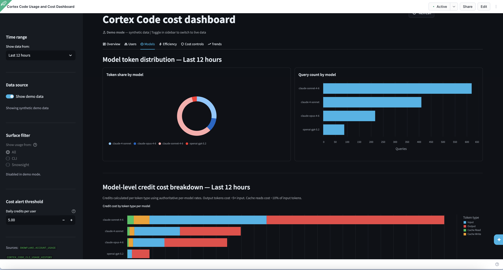

# Cortex Code Cost Dashboard

A Streamlit app for Snowflake platform owners to monitor **Cortex Code** usage, credit consumption, and cost efficiency across their organization.



## What's covered

| Tab | Contents |
|---|---|
| **Overview** | Executive KPIs, CLI vs Snowsight spend split, daily spend trend, AI Services billing context |
| **Users** | Per-user credit/cost breakdown, user × model heatmap |
| **Models** | Token distribution by model, credit cost breakdown by token type |
| **Efficiency** | Cache hit rate per user, output/input ratio per user |
| **Cost Controls** | Rolling 24h spend vs alert threshold, daily limit SQL, governance reference |
| **Trends** | Hourly/daily credit and user trends, new user onboarding growth |

Supports **synthetic demo data** when no real Cortex Code usage is available in the selected time window.

---

## Before you start

### 1. Create a `.env` file

The deployment target (database, schema, warehouse) is configured via environment variables, not hardcoded in `snowflake.yml`. Create a `.env` file in the project root:

```
database=MY_DB
schema=PUBLIC
warehouse=COMPUTE_WH
```

Replace the values with your own. Any existing database and schema will work. The warehouse just needs to be able to run queries.

> `.env` is git-ignored so it won't be committed. Each developer sets their own.

### 2. Required privilege

The Snowflake role used to run the app must have `ACCOUNTADMIN` or `MONITOR USAGE` — both are needed to read `SNOWFLAKE.ACCOUNT_USAGE` views.

That's it. No other account-specific changes are needed. All queries target `SNOWFLAKE.ACCOUNT_USAGE`, which is standard in every Snowflake account.

---

## Data sources

All data is read from `SNOWFLAKE.ACCOUNT_USAGE` — requires `ACCOUNTADMIN` or `MONITOR USAGE` privilege.

| View | Available since |
|---|---|
| `CORTEX_CODE_CLI_USAGE_HISTORY` | 2026-02-15 |
| `CORTEX_CODE_SNOWSIGHT_USAGE_HISTORY` | 2026-03-11 |
| `METERING_DAILY_HISTORY` | — |

> Views have a latency of **45 minutes to 2 hours**.

---

## Repository structure

```
cortex-code-cost-dashboard/
├── cortex_code_cost_dashboard.py   # Streamlit app (main file)
├── cost-queries.sql                # Reference SQL queries for manual analysis
├── snowflake.yml                   # Snowflake CLI deployment config (templated)
├── environment.yml                 # Conda dependencies for SiS warehouse runtime
├── .env                            # Deploy target config (git-ignored, create your own)
├── pyproject.toml                  # Python dependencies (local dev only)
├── .streamlit/
│   └── config.toml                 # Light theme configuration
└── README.md
```

---

## Option 1 — Deploy to Streamlit-in-Snowflake with Snowflake CLI (recommended)

This deploys the app as a **Streamlit-in-Snowflake (SiS)** app running on a warehouse runtime.

### Prerequisites

- [Snowflake CLI (`snow`)](https://docs.snowflake.com/en/developer-guide/snowflake-cli/index) installed
- A configured Snowflake connection (in `~/.snowflake/connections.toml`)

### How it works

The app runs inside Snowflake's warehouse runtime, which uses **conda** (not pip) for dependency management. Key files:

| File | Purpose |
|---|---|
| `snowflake.yml` | Defines the Streamlit entity and artifacts. Database, schema, and warehouse are templated via `<% ctx.env.* %>` — values come from `.env` |
| `.env` | Sets `database`, `schema`, and `warehouse` environment variables (git-ignored) |
| `environment.yml` | Pins package versions via the [Snowflake Anaconda Channel](https://repo.anaconda.com/pkgs/snowflake/) (conda). This is how you control the Streamlit version in warehouse runtimes |
| `cortex_code_cost_dashboard.py` | Main app file. Uses `get_active_session()` from `snowflake.snowpark.context` for the Snowflake connection |
| `.streamlit/config.toml` | Theme configuration |

> **Note:** `pyproject.toml` is for local development only. Warehouse runtimes ignore it — only `environment.yml` is used for dependency resolution.

### Deploy

Source the `.env` file to export variables, then deploy:

```bash
set -a && source .env && set +a && snow streamlit deploy --replace
```

Or specify a connection explicitly:

```bash
set -a && source .env && set +a && snow streamlit deploy -c <your-connection-name> --replace
```

`set -a` auto-exports all sourced variables; `set +a` turns it off. The `<% ctx.env.* %>` templates in `snowflake.yml` resolve from these environment variables.

You can also override individual values at deploy time without editing `.env`:

```bash
set -a && source .env && set +a && snow streamlit deploy --replace --env database=DEV_DB
```

### Verify the deployment

After deploying, confirm the app picked up the correct packages:

```sql
DESCRIBE STREAMLIT <DATABASE>.<SCHEMA>.CORTEX_CODE_USAGE_AND_COST_DASHBOARD;
```

Check the `user_packages` column — it should show `streamlit==1.52.2,altair,pandas,numpy`.

### Changing the Streamlit version

Edit `environment.yml` and set the version to any [supported warehouse runtime version](https://docs.snowflake.com/en/developer-guide/streamlit/app-development/dependency-management):

```yaml
name: sf_env
channels:
  - snowflake
dependencies:
  - streamlit=1.52.2    # pin to a supported version
  - altair
  - pandas
  - numpy
```

Then redeploy with `snow streamlit deploy --replace`. Only versions available in the Snowflake Anaconda Channel are supported (1.22.0 through 1.52.2 as of this writing).

---

## Option 2 — Deploy with Cortex Code (AI-assisted)

Use [Cortex Code](https://docs.snowflake.com/en/user-guide/cortex-code/cortex-code-cli) to deploy with a natural language prompt — no need to remember CLI flags.

### Prerequisites

- Cortex Code CLI installed
- A configured Snowflake connection

### One-shot (non-interactive)

```bash
set -a && source .env && set +a && cortex -p "Deploy the Streamlit app defined in snowflake.yml to Snowflake" --connection <your-connection>
```

Cortex Code reads `snowflake.yml`, runs `snow streamlit deploy --replace`, and reports the result.

### Interactive

```bash
set -a && source .env && set +a && cortex --connection <your-connection>
```

Then type at the prompt:

```
Deploy the Streamlit app to Snowflake using snowflake.yml
```

Cortex Code will show you the deployment plan and ask for confirmation before executing.

### Tip — plan before deploying

Prefix your prompt with `/plan` to review exactly what will run before anything is executed:

```
/plan Deploy the Streamlit app to Snowflake using snowflake.yml
```

---

## Option 3 — Run locally

### Prerequisites

Python 3.11+ and [uv](https://github.com/astral-sh/uv) (or pip).

### Install dependencies

```bash
uv sync
# or: pip install -e .
```

### Configure a Snowflake connection

Create `.streamlit/secrets.toml` (this file is git-ignored):

```toml
[connections.snowhouse]
account   = "your-account-identifier"
user      = "your-user"
password  = "your-password"
warehouse = "your-warehouse"
role      = "ACCOUNTADMIN"
```

### Run

```bash
streamlit run cortex_code_cost_dashboard.py
```

---

## Option 4 — Upload via Snowsight

1. Open Snowsight → **Streamlit** → **+ Streamlit App**
2. Upload `cortex_code_cost_dashboard.py` as the main file
3. Upload `environment.yml` and `.streamlit/config.toml` as additional files
4. Set the warehouse and click **Run**

> Do **not** upload `pyproject.toml` — warehouse runtimes use `environment.yml` for dependencies.

---

## Sidebar controls

| Control | Description |
|---|---|
| **Time range** | Last 12h / 24h / 7d / 30d / 90d |
| **Demo mode** | Toggle synthetic data on/off (auto-enabled when no real data found) |
| **Surface filter** | All / CLI only / Snowsight only |
| **Daily credit threshold** | Alert threshold for the Cost Controls tab |

---

## Cost controls (April 2, 2026)

Snowflake introduced per-user daily credit limits on a rolling 24-hour window.

```sql
-- Account-level limit for all users
ALTER ACCOUNT SET CORTEX_CODE_CLI_DAILY_EST_CREDIT_LIMIT_PER_USER = 5;
ALTER ACCOUNT SET CORTEX_CODE_SNOWSIGHT_DAILY_EST_CREDIT_LIMIT_PER_USER = 5;

-- Override for a specific user
ALTER USER alice SET CORTEX_CODE_CLI_DAILY_EST_CREDIT_LIMIT_PER_USER = 10;

-- Inspect current settings
SHOW PARAMETERS LIKE 'CORTEX_CODE%' IN ACCOUNT;
SHOW PARAMETERS LIKE 'CORTEX_CODE%' IN USER alice;
```

`-1` = no limit · `0` = block access · positive value = rolling 24h cap

---

## Reference SQL

`cost-queries.sql` contains standalone queries for manual analysis outside the dashboard:

- **C1** — CLI daily credits & tokens by user
- **C2** — Snowsight daily credits & tokens by user
- **C3** — Combined CLI + Snowsight daily summary by channel
- **C4** — Model-level token & credit breakdown using `TOKENS_GRANULAR`
